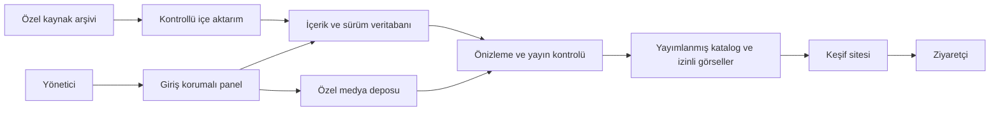

# Sistem tasarımı — öneri, henüz uygulanmadı

## Mevcut sistem sınırı

Şu anda yerel kaynak arşivi, JSON veri seti ve tıklanabilir keşif prototipi var. Üretim backend’i, veritabanı, kimlik doğrulama, yönetim paneli ve canlı yayın henüz yok. Aşağıdaki yapı bu boşluğu doldurmak için öneridir; teknoloji/sağlayıcı seçimi bütçe ve MVP yanıtlarına bağlıdır.

## Önerilen ilk yapı

Tek web uygulaması ve korunan bir yönetim alanı öneriyorum. Yönetici paneli artık açık bir gereksinim: mekân düzenleme, fotoğraf yükleme, etiket atama, taslak ve yayın ayrı desteklenecek. JSON arşivi başlangıç ve yedek kaynağı olarak kalır; canlı düzenlemelerin tek kayıt yeri olarak kullanılmaz.

Uygulama için bir ilişkisel veritabanı, medya deposu ve yönetici kimlik doğrulaması öneriliyor. Belirli ürün veya sağlayıcı seçilmedi. Hazır içerik yönetimi ile özel `/admin` alanını aynı kabul ölçütleriyle karşılaştıracağız; karar yönetici akışı netleşince verilecek. Tek servisle başlayabiliriz; ayrı mikroservis veya arama kümesi için henüz gerekçe yok.

Tarayıcıya ham arşiv veya bütün veritabanı kaydı gönderilmez. Yayın çıktısı açık bir alan listesinden üretilir. Taslak, kaynak gözlemi, iç not ve denetim geçmişi yönetim tarafında kalır. Sunucu bütün yazma, medya ve önizleme isteklerinde yetkiyi denetler. Yönetici için giriş zorunludur; ziyaretçi için hesap açılması şart değildir.

Yayındaki sürüm ile düzenlenen taslak ayrı tutulur. Yayın, katalog ve ilgili etiket/medya görünümünü birlikte günceller; başarısız olursa önceki sürüm kullanılmaya devam eder. Eşzamanlı kaydetmede içerik sürümü kontrol edilerek sessiz veri kaybı önlenir.

## Bileşen sorumlulukları

| Bileşen | Görev | Hata davranışı |
|---|---|---|
| Katalog | Şehir ve kalıcı mekân kimliğiyle yayımlanmış kayıt okumak | Olmayan kayıt için anlamlı bulunamadı görünümü |
| Keşif | Desteklenen alanlarda arama, filtre, sayfalama | Boş sonuç ve geçersiz filtre kontrollü işlenir |
| Mekân detayı | İçerik, puan/kanıt ve pratik bilgileri sunmak | Tek medya hatası sayfayı bozmaz |
| Yönetim paneli | Mekân, etiket, medya, taslak ve yayın yönetimi | Kaydetme başarısızsa form korunur; yetkisiz istek reddedilir |
| Medya işleme | Dosya doğrulama, özel orijinal ve yayımlanabilir türev üretimi | Yarım/uygunsuz dosya yayımlanmaz |
| İçerik hazırlama | İçe aktarma, eşleştirme, kontrol, yayın çıktısı | Hatalı kayıt karantinaya alınır; diğer kayıtlar sessizce bozulmaz |
| Sağlayıcı erişimi | Kaynak verisini izin, kota ve maliyet sınırlarıyla almak | Zaman aşımı, erişim reddi, kota ve bulunamadı ayrı kaydedilir |
| Yayın | Kontrol edilmiş sürümü sunmak, önceki sürüme dönmek | Hatalı yayında son doğrulanmış sürüme dönüş |

## Mantıksal veri modeli

`City → Venue → SourceObservation` temelidir. Her fiziksel şube ayrı Venue. ExternalPlace, RatingObservation, Dish, SocialLink, MediaReference ve EditorialNote bir mekâna bağlıdır. Brand ilişkisi ancak doğrulandığında kurulur. Kimlikler ad veya adrese bağlı yeniden hesaplanmaz. AdminAccount, ContentRevision ve AuditEvent yönetim için gereklidir. TagDefinition ve VenueTagAssignment etiket sözlüğü ile mekâna atamayı ayırır. MediaAsset dosya, hak, sıra ve kapak bilgilerini tutar. Ziyaretçi User ve Favorite varlıkları ise üyelik/kaydetme kararı verilirse eklenir.

Mevcut `venue.schema.json` başlangıç sözleşmesidir. Üretim öncesinde tam JSON Schema doğrulaması, tarih/URL/puan sınırı kontrolleri, kaynak referansları ve yayın koşulları ek kontrole ihtiyaç duyar. Bir şema dosyasının bulunması verinin doğrulanmış olduğu anlamına gelmez.

## Yayın akışı

1. Kaynak gözlemini sakla; mevcut editoryal bilgiyi silme.
2. Aynı şube olduğuna ilişkin kanıtı değerlendir; şüpheli eşleşmeyi incelemeye bırak.
3. İçerik ve kullanım şartlarını kontrol et.
4. Yayına uygun alanları seç; şema ve iş kuralı kontrolünden geçir.
5. Önizlemede doğrula; onaylanan çıktı sürümünü yayımla.
6. Yayın sürümü, veri sürümü ve hata durumunu kaydet; önceki sürümle geri dönüşü dene.

## Önerilen kalite hedefleri

Mobilde ana karar akışının tamamlanması, klavyeyle erişilebilir temel kontroller, özel verilerin tarayıcı paketine girmemesi, test verisinin yayımlanmaması ve sağlayıcı kesintisinde temel kataloğun kullanılabilmesi. Performans ölçüm cihazı, bağlantı profili ve hedefleri UX prototipinden sonra belirlenir; şu an ölçüm sonucu yoktur.

## Uygulama öncesinde kapatılacak teknik kararlar

ADR-001: yönetilebilir içerik deposu, sürümler ve arşivden aktarım; öneri ilişkisel veritabanı. ADR-002: dil, framework, test araçları ve barındırma. ADR-003: sağlayıcılar, saklama süreleri ve medya sunumu. ADR-004: zorunlu yönetici girişi, oturum ve sunucu yetki kontrolleri. ADR-005: hazır içerik yönetimi / özel yönetim alanı karşılaştırması. Her karar seçenek, gerekçe, maliyet sınırı, sonuçlar ve geri dönüş yolunu içerir. Somut sağlayıcı seçilirken güncel resmî dokümantasyon ayrıca doğrulanır.

Panelin iş kuralları [yönetim belgesinde](10-yonetim-paneli.md), etiket ilişkileri [etiket belgesinde](11-etiketler.md). Bu değişiklik bir tasarım güncellemesidir; henüz veritabanı veya servis kurulmadı.
