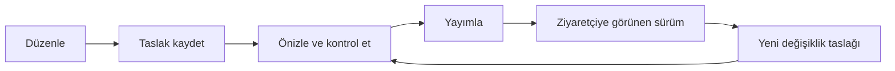

# Mekânları kendimiz yönetebilmek

## İhtiyaç

Bir adres düzeltmek, fotoğraf eklemek veya etiketi değiştirmek için kod dosyası açmak istemiyoruz. İlk sürümde senin giriş yapabildiğin bir web yönetim paneli olacak. Ziyaretçiler üye olmadan keşfetmeye devam edebilir; yönetici girişi bundan ayrı bir ihtiyaç.

Bu belge planlanan davranışı anlatıyor. Şu an çalışan admin paneli, kullanıcı hesabı veya fotoğraf depolama servisi yok.

## Panelde hangi ekranlar olacak?

| Ekran | Burada ne yapacağız? |
|---|---|
| Mekânlar | Şehir, isim, yayın durumu, etiket ve eksik içeriğe göre bulma; yeni kayıt oluşturma; düzenleme |
| Mekân düzenleme | Genel bilgiler, yemekler/editör notları, etiketler, fotoğraf/video, kaynaklar ve geçmiş sekmeleri |
| Etiketler | Ortak etiket ekleme, açıklamasını yazma, yeniden adlandırma ve kullanımdan kaldırma |
| İnceleme kuyruğu | Adres çelişkisi, eksik fotoğraf izni, eski etiket veya başarısız kontrolü görme |
| Önizleme | Kaydı ziyaretçinin göreceği biçimde, giriş gerektiren bir alanda inceleme |
| Geçmiş | Hangi alanın ne zaman değiştiğini görme ve eski bir sürümü yeni taslak olarak geri getirme |

Temalı seçki yönetimi sonraki adım. İlk panelin önceliği mekân kaydı ve içeriği; restoran işletmecilerine ayrı hesap açmıyoruz.

## Bir kaydı düzenlemek

Mekân listesinden kaydı açarsın. Ad, adres, konum, bağlantılar ve açıklamalar düzenlenebilir. Kalıcı kimlik sabit kalır. Kaynaktan gelen orijinal değerler ayrı bölümde durur; adresi düzeltmek orijinal arşivi silmez. Yeni mekân eklerken şehir ve şube bilgileriyle olası eşleşmeler gösterilir, karar otomatik birleştirmeye dönüşmez.

“Burada ne yenir?”, “Neden gidilir?” ve “Gitmeden bil” ayrı alanlar olacak. Kaynağı ve kontrol tarihi de aynı ekrandan girilecek. Sağlayıcı puanını kendi düşüncemizle değiştirip Google puanı gibi göstermeyeceğiz; editoryal not için ayrı alan kullanacağız.

Kaydedilmemiş değişiklik varken sayfadan ayrılınca uyarı gösterilir. Kayıt başarısız olursa form içeriği korunur. Başka sekmede daha yeni bir sürüm kaydedilmişse sessizce üzerine yazılmaz; fark gösterilip yeniden değerlendirme istenir.

## Fotoğraf ve video eklemek

Bilgisayardan fotoğraf seçebilirsin. İlk uygulama için JPEG, PNG ve WebP ile dosya başına 10 MB sınırı öneriyorum; gerçek telefon fotoğraflarıyla denedikten sonra bu sınırı netleştiririz. HEIC bu öneride desteklenmez ve kullanıcıya dönüştürme gerektiği söylenir. Bu, mevcut bir kısıt değil, geliştirme kararı taslağıdır.

Yükleme sırasında ilerleme ve hata görünür. Fotoğrafın açıklaması, alternatif metni, sahibi/kaynağı ve kullanım durumu girilir. Kapak seçilebilir, sıra değiştirilebilir, yanlış fotoğraf taslaktan çıkarılabilir. 3–5 fotoğraf içerik hedefidir; zorla bu sayıya tamamlamak veya sahte fotoğraf kullanmak gerekmiyor.

Dosya uzantısına güvenmeyen sunucu kontrolü, çözümleme ve boyut sınırı gerekir. Kamuya sunulan kopyadan konum gibi EXIF bilgileri çıkarılır. Orijinal ve taslak dosyalar özel tutulur; ziyaretçiye yalnız yayımlanmasına izin verilen türev sunulur. İşlem yarıda kalırsa bozuk dosya galeriye girmez. Aynı yükleme yeniden denendiğinde yinelenen içerik üretmemesi beklenir.

Kullanım hakkı bilinmeyen medya taslakta kalabilir ama yayımlanamaz. Eski sürümde kullanılan bir dosya galeri düzenlenince depodan hemen silinmez; geri dönüş ve temizleme ayrı süreçlerdir. Hak geri çekilmesi halinde medya engellenir ve eski sürüme dönüş onu yeniden yayımlayamaz.

Video için ilk adım, desteklenen platform bağlantısını eklemek. Keyfî HTML veya script yapıştırılmayacak. Yerleştirme kapalıysa uygun dış bağlantı seçeneği veya açık bir hata gösterilecek. Fotoğraf yükleme yetkisi, dış platformlardan izinsiz toplama yöntemi anlamına gelmez.

## Kaydetmek ve yayımlamak ayrı işler

Yayındaki bir kaydı düzenlediğinde eski sürüm yayında kalır. Yalnız “Yayımla” dediğinde yeni sürüm görünür. Eksik zorunlu bilgiler, şüpheli bağlantı veya medya izni gibi engeller alanın yanında açıklanır. Yayın sırasında hem kayıt hem arama/etiket görünümü aynı sürüme geçmelidir; yarım yayın başarı diye gösterilmez.

“Yayından kaldır” mekânı ziyaretçi listesinden çıkarır; kaynak ve düzenleme geçmişini korur. “İşletme kapandı” ise mekânla ilgili ayrı bir bilgidir. Yanlışlıkla yayından kaldırılan açık bir işletmeyi kapalı diye işaretlemeyiz. Arşivlemek geri alınabilir; ilk panelde kalıcı silme düğmesi gerekmiyor.

## Kim ne yapabilir?

İlk kullanımda tek yönetici sensin: mekân, etiket ve medya düzenleme; yayınlama; yayından kaldırma; geçmişten taslak oluşturma. Sonradan biri içerik hazırlamaya yardım ederse “editör” rolü eklenebilir: taslak hazırlayabilir ama yayın ve yetki yönetimi yapamaz. Bu rol sonraki aşama; ilk sürüm için karmaşık bir ekip yapısı kurmuyoruz.

Yetki yalnız menü gizleyerek uygulanmaz. Kayıt, medya yükleme, önizleme ve yayın istekleri sunucuda kontrol edilir. Oturumsuz ziyaretçi özel içeriği okuyamaz ve değişiklik yapamaz. Başka bir kullanıcı hesabı gerekiyorsa ayrı açılır; ortak parola kullanımını sistemin temeli yapmayız. Oturum açma yöntemi ve sağlayıcı henüz seçilmedi.

## Panelin hazır olduğunu nasıl anlayacağız?

1. Yönetici giriş yapar, bir kaydı bulur ve adresini değiştirir. Kimlik ve kaynak kaydı korunur.
2. Taslağı kaydedip sayfayı yenileyince değişiklik kalır; ziyaretçi eski yayını görür.
3. Fotoğraf yükler, kapak/sıra/açıklama belirler; desteklenmeyen dosyada anlaşılır hata alır.
4. Var olan etiketi ekler, çıkarır; bir etiketi yeniden adlandırınca bağlı mekânlar kaybolmaz.
5. Önizlemede kontrol edip yayımlar; ziyaretçi doğru metni, etiketleri ve izinli fotoğrafı görür.
6. Bir değişikliği eski sürümden taslağa geri getirir; tekrar yayımlamadan canlı görünüm değişmez.
7. Oturumsuz isteklerin düzenleme, yayın, medya yükleme ve özel önizlemeye erişemediği denenir.
8. İki sekmeden aynı kaydı kaydetme, yükleme hatası, yayından kaldırma ve medya izni geri çekme akışları denenir.

## Teknik yaklaşım

Önerim ayrı bir masaüstü programı yerine webden açılan yönetim paneli. Aynı projenin yönetim alanı olabilir; hazır bir içerik yönetim sistemi de değerlendirebiliriz. Seçimi yalnız form oluşturma hızına göre yapmayacağız: taslak/yayın ayrımı, sürüm geçmişi, medya yetkisi ve etiket ilişkileri çalışmalı.

Bu gereksinimle JSON dosyalarını elle düzenlemek yeterli kalmıyor. Düzenlemeleri tutan bir veritabanı, dosyalar için depolama alanı ve yönetici kimlik doğrulaması planın parçası. Ziyaretçi tarafı yine hız için yayımlanmış bir katalog çıktısı kullanabilir. Framework, veritabanı ürünü, depolama sağlayıcısı ve bütçe kararı açık.
